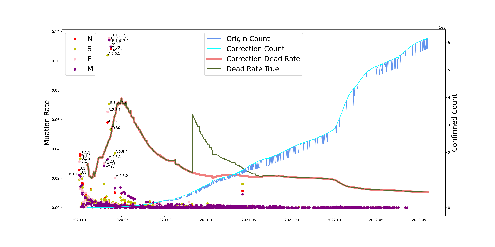
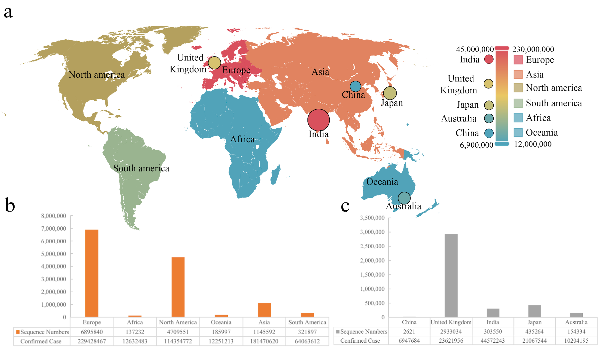

# rate_sars
## The  Evolution of SARS-CoV-2 and COVID-19 Pandemic
Scientists have made great efforts to understand the evolution of SARS-CoV-2 (Severe Acute Respiratory Syndrome Coronavirus 2) to provide crucial information to public health experts on strategies to control this viral pathogen. The pandemic of the coronavirus disease that began in 2019, COVID-19, lasted nearly three years, and nearly all countries have set different epidemic prevention policies for this virus. The continuous evolution of SARS-CoV-2 alters its pathogenicity and infectivity in human hosts, thus the policy and treatments have been continually adjusted. Based on our previous study on the dynamics of binding ability prediction between the COVID-19 spike protein and human ACE2, the present study mined over 10 million sequences and epidemiological data of SARS-CoV-2 during 2020-2022 to understand the evolutionary path of SARS-CoV-2. We analyzed and predicted the mutation rates of the whole genome and main proteins of SARS-CoV-2 from different populations to understand the adaptive relationship between humans and COVID-19. Our study identified a correlation of the mutation rates from each protein of SARS-CoV-2 and various human populations. Overall, this analysis provides a scientific basis for developing data-driven strategies to confront human pathogens.


<center>Figure 1. The evolutionary events of SARS-CoV-2 and global public health. 
</center>


# Requirements
- Python >= 3.6 (3.8 recommended)
- scikit-learn == 1.0.2
- matplotlib == 3.5.2 
- seaborn == 0.11.2
- Pandas == 1.4.3
# Usage
 
```linux
git clone https://github.com/wvdon/rate_sars.git
```

```linux
python mutation_rate muation_rate.py
```
## DATA

This work therefore collected 13,396,972 whole genome sequences of SARS-CoV-2 from GISAID (https://gisaid.org/)


<center>Figure 2. The sequence number of different areas or countries.</center>


Some of the results are in the data file directory! the origin data comes from GISAID by 2022-10-09!
# License
This project is licensed under the MIT License. See LICENSE for more details
# Cite
Please Wait a Moment
```text
The  Evolution of SARS-CoV-2 and COVID-19 Pandemic
```
